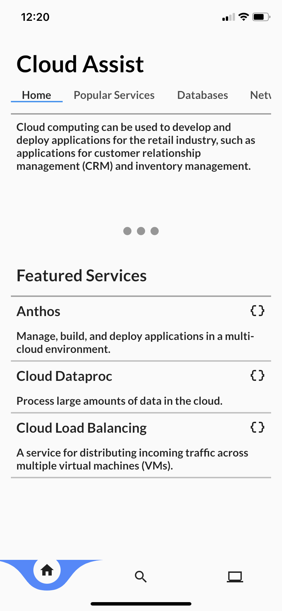
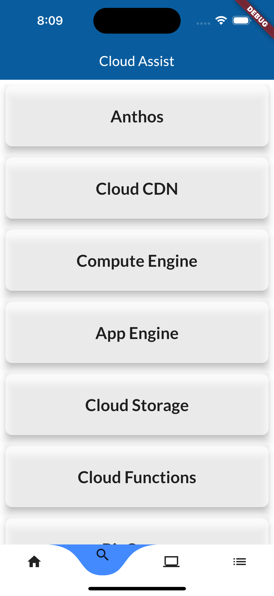

# GPC Cloud reference app Cloud Assist

Welcome to the GCP Cloud reference app! 

Cloud Assist is the ultimate reference and resource app for learning about cloud services. Whether you are a beginner or an experienced cloud user, Cloud Assist provides comprehensive and up-to-date information on a wide range of cloud computing topics.

With Cloud Assist, you can easily access a wealth of resources that cover everything from the basics of cloud computing to advanced topics like cloud security, data analytics, and machine learning.
Cloud Assist also includes a powerful search feature that allows you to quickly find the information you need.

In addition to its extensive library of resources, Cloud Assist also provides a glossary of cloud computing terms and acronyms, as well as a directory of cloud service providers and their offerings. This makes it easy to compare different cloud providers and find the one that best meets your needs.

Whether you are a business owner looking to move your operations to the cloud, an IT professional responsible for managing cloud infrastructure, or just someone who wants to learn more about this exciting technology, Cloud Assist is the perfect app for you. Download it today and start exploring the world of cloud computing!

## Social Media ✨
- [Twitter](https://twitter.com/RandyNolden)

## UI

Thanks for visiting and we hope you get the most out of the app!

Kai Technologies Corp. <Randy@kaitechcorp.com>

This program is free software: you can redistribute it and/or modify it under the terms of the GNU General Public License as published by the Free Software Foundation, either version 3 of the License, or (at your option) any later version.

This program is distributed in the hope that it will be useful, but WITHOUT ANY WARRANTY; without even the implied warranty of MERCHANTABILITY or FITNESS FOR A PARTICULAR PURPOSE. See the GNU General Public License for more details.

You should have received a copy of the GNU General Public License along with this program. If not, see <https://www.gnu.org/licenses/>.
