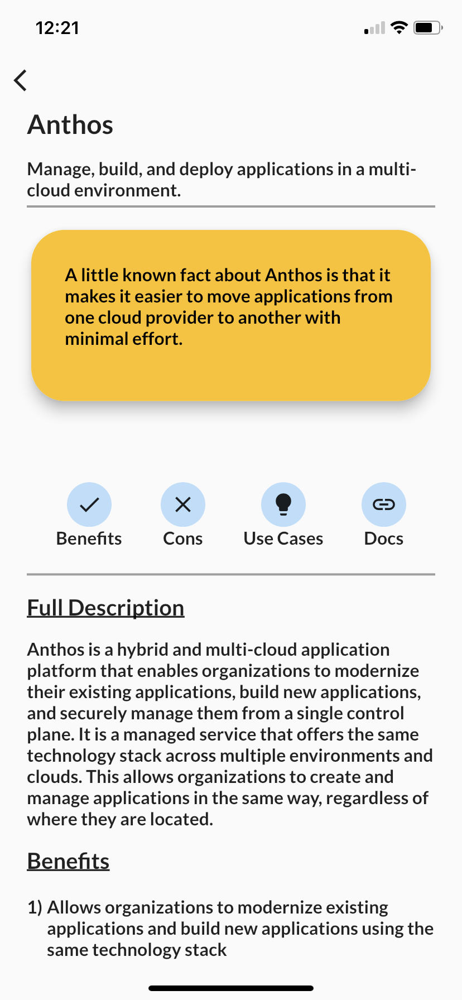

# GPC Cloud reference app Cloud Assist

Welcome to the GCP Cloud reference app! 

This app is designed to provide you with a comprehensive overview of the various Google Cloud Platform (GCP) services. It includes a comprehensive list of GCP services, their pros and cons, and relevant use cases. Additionally, it includes various command line tools and detailed information on Cloud positions. 

This app is the perfect reference guide for anyone who wants to become more familiar with the GCP offering. It will help you make an informed decision when choosing and implementing a cloud platform. 

## Social Media ✨
- [Twitter](https://twitter.com/RandyNolden)

Home Screen

Service List

Service Details

GCP command line resource

Thanks for visiting and we hope you get the most out of the app!

Kai Technologies Corp. <Randy@kaitechcorp.com>

This program is free software: you can redistribute it and/or modify it under the terms of the GNU General Public License as published by the Free Software Foundation, either version 3 of the License, or (at your option) any later version.

This program is distributed in the hope that it will be useful, but WITHOUT ANY WARRANTY; without even the implied warranty of MERCHANTABILITY or FITNESS FOR A PARTICULAR PURPOSE. See the GNU General Public License for more details.

You should have received a copy of the GNU General Public License along with this program. If not, see <https://www.gnu.org/licenses/>.
